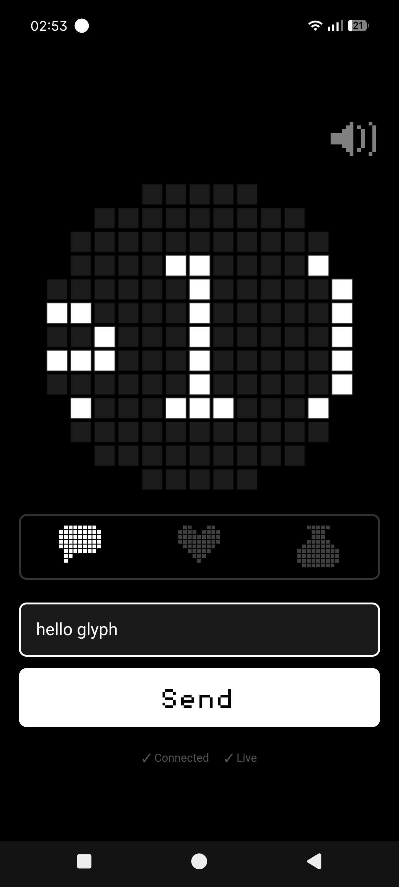
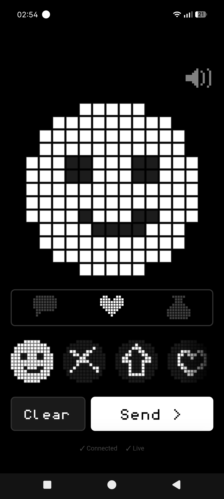
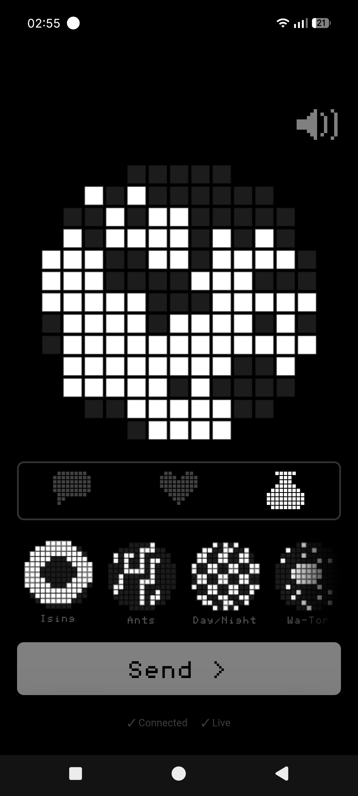
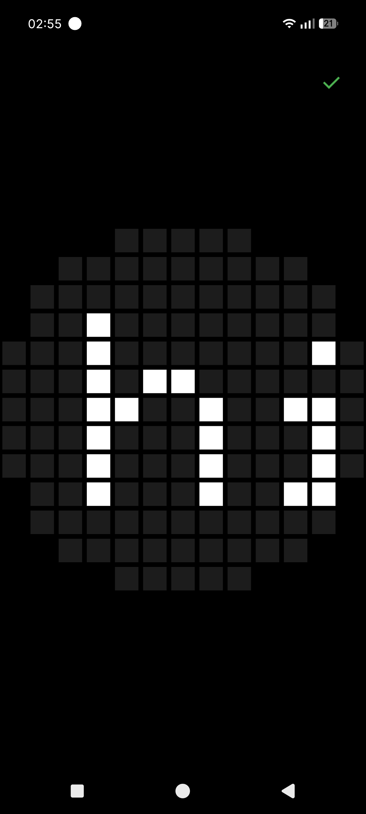
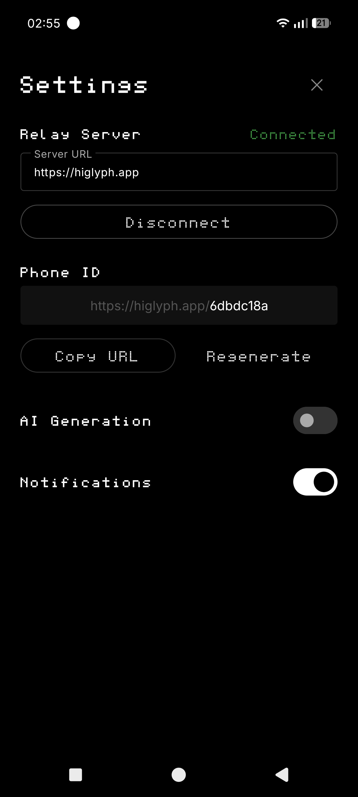
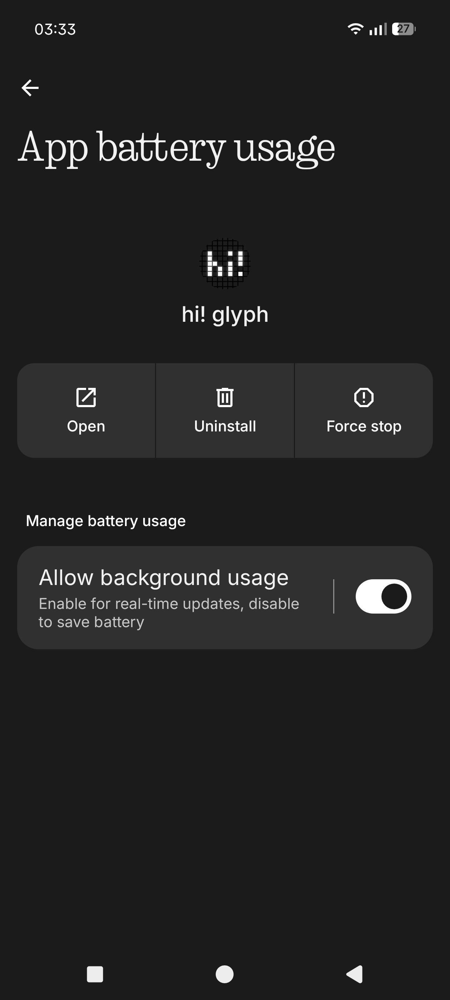
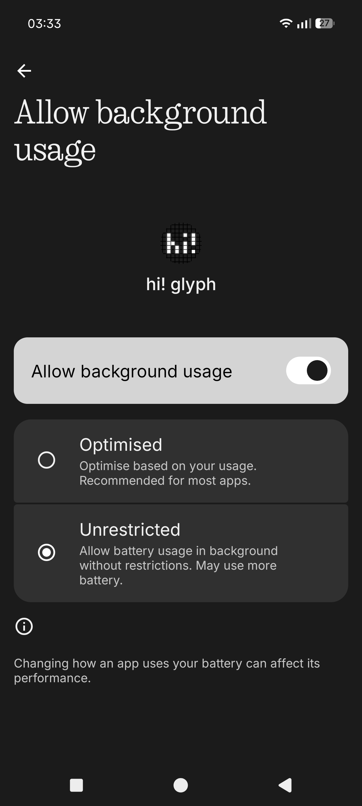
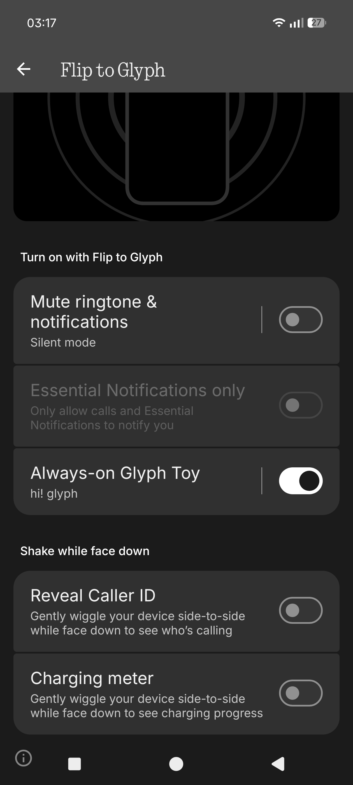
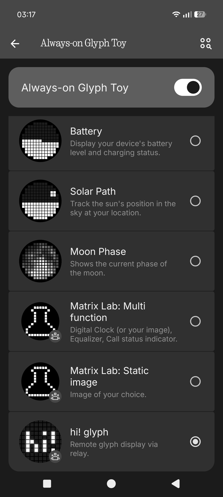

# hi! glyph

[](https://github.com/alexmicuplusfour/hi-glyph/releases/latest/download/app-debug.apk)

Control the Nothing Phone (4a) Pro's 13×13 LED matrix from any browser, anywhere.

Install the Android app, point it at a relay server, and anyone with the link can send messages, draw pixel art, or run animations on the display.

---

<table>
  <tr>
    <td></td>
    <td></td>
    <td></td>
  </tr>
  <tr>
    <td align="center">Send text</td>
    <td align="center">Draw pixel art</td>
    <td align="center">Run animations</td>
  </tr>
</table>

<table>
  <tr>
    <td></td>
    <td></td>
  </tr>
  <tr>
    <td align="center">Matrix display</td>
    <td align="center">App settings</td>
  </tr>
</table>

---

## Setup

1. [Download and install the APK](https://github.com/alexmicuplusfour/hi-glyph/releases/latest/download/app-debug.apk) — the app connects to `higlyph.app` automatically and gives you a personal URL to share
2. Go to **Settings → Apps → hi! glyph → App battery usage** — enable **Allow background usage** and set it to **Unrestricted** (required to keep the relay connection alive)
3. Go to **Settings → Glyph Interface → Flip to Glyph** — enable **Always-on Glyph Toy** and select **hi! glyph**

<table>
  <tr>
    <td></td>
    <td></td>
    <td></td>
    <td></td>
  </tr>
  <tr>
    <td align="center">Allow background usage</td>
    <td align="center">Set to Unrestricted</td>
    <td align="center">Enable Always-on Glyph Toy</td>
    <td align="center">Select hi! glyph</td>
  </tr>
</table>

---

## How it works

```
[Browser at higlyph.app/uuid] → [Relay Server] → WebSocket → [Android App] → [LED Matrix]
```

The Android app runs as an AOD toy on the phone and maintains a persistent WebSocket connection to the relay. The relay hosts a web UI — open it on any device and whatever you send appears on the matrix.

---

## Components

### `android-app/`

Kotlin app for Nothing Phone (4a) Pro. Registers as a Glyph Toy, connects to the relay server, and drives the 13×13 LED matrix.

See [android-app/BUILD.md](android-app/BUILD.md) for build instructions.

### `relay-server/`

Node.js + Express server. Hosts the web UI and brokers messages between browsers and phones over WebSocket. Supports multiple phones simultaneously via UUID-scoped routes.

A public instance runs at **[higlyph.app](https://higlyph.app)**.

---

## Self-hosting the relay

```bash
cd relay-server
npm install
npm start
# Server runs on port 3000
```

Then point the Android app at your server URL in its settings.

For production: put nginx in front (see the nginx config in the repo), get a cert with Certbot, and run the server with `pm2`.

---

## Credits

Built with the [Nothing Glyph Matrix SDK](https://github.com/Nothing-Developer-Programme).

Original "Matrix Lab" project by [sajenko](https://github.com/sajenko) — extended with relay server and web control.

Made by [alexmicuplusfour](https://github.com/alexmicuplusfour).

---

## License

GPL-3.0 — see [android-app/LICENSE](android-app/LICENSE).
